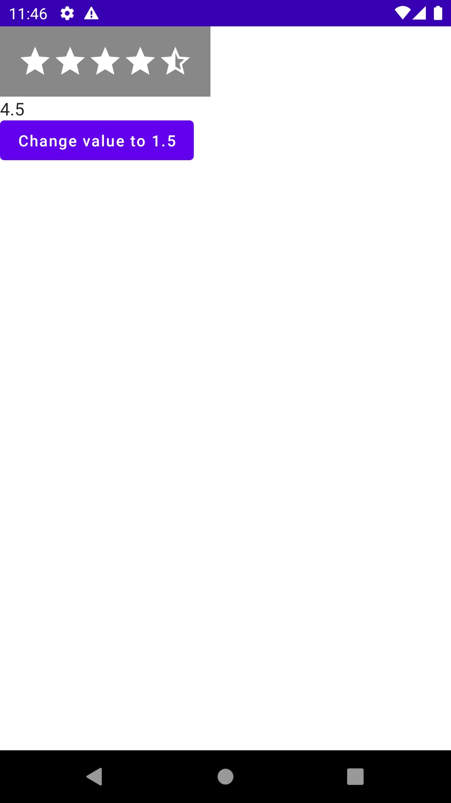

# Jetpack Compose RatingBar
[](https://jitpack.io/#gevorg89/RatingBar)
> The simple RatingBar library for Jetpack Compose!

### Implementation
from JitPack:
```gradle
allprojects {
    repositories {
        ...
        maven { url 'https://jitpack.io' }
    }
}

dependencies {
    implementation 'com.github.gevorg89:RatingBar:LATEST_VERSION'
}
```

### How use
``` kotlin
var valueState by remember { mutableStateOf(4.5f) }
RatingBar(
            modifier = Modifier
                .background(Color.Gray)
                .padding(16.dp),
            empty = {
                StarRating(R.drawable.ic_baseline_star_outline_24, width)
            },
            filled = {
                StarRating(R.drawable.ic_baseline_star_24, width)
            },
            stepSize = 0.5f,
            steps = 5,
            value = valueState
        ) { rating ->
            valueState = rating
        }
        Column{
            Text(text = valueState.toString())
            Button(onClick = {
                valueState = 1.5f
            }) {
                Text(text = "Change value to 1.5")
            }
        }
```
>You can set any Composable fun in empty/filled block

### Examples:
``` kotlin
@Composable
private fun StarRating(@DrawableRes drawable: Int, width: Dp = 24.dp) {
    Image(
        painterResource(drawable),
        contentDescription = "",
        modifier = Modifier.size(width)
    )
}
```


``` kotlin
@Composable
private fun CircleRating(color: Color, width: Dp) {
    Column(
        Modifier
            .size(width)
            .clip(CircleShape)
            .background(color)
    ) {}
}
```


``` kotlin
@Composable
private fun AndroidRating(tint: Color) {
    Image(
        painterResource(R.drawable.ic_baseline_android_24),
        contentDescription = "",
        modifier = Modifier.fillMaxSize(),
        colorFilter = ColorFilter.tint(color = tint)
    )
}
```


``` kotlin
@Composable
private fun TextRating(color: Color) {
    Text(
        text = "Hello Android!!!",
        color = color
    )
}
```
